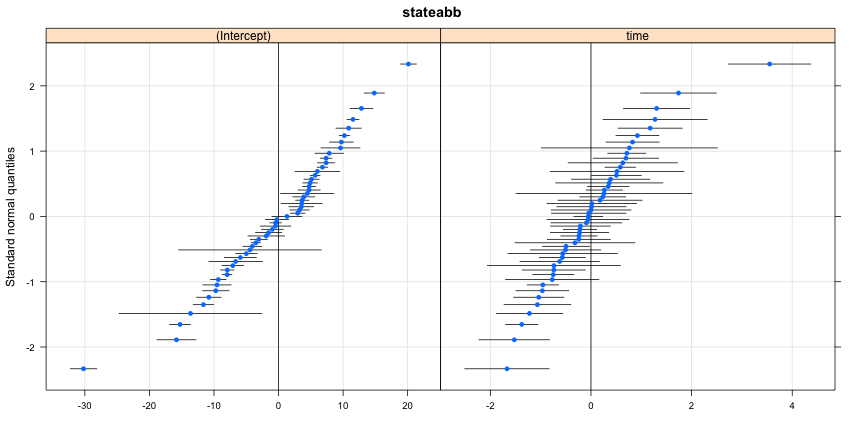
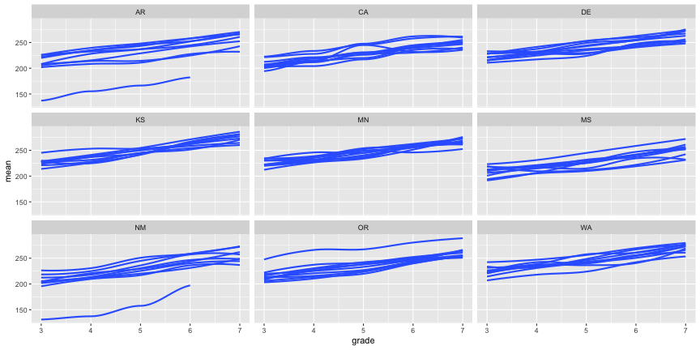

```r
cor(sim)
```

```
##           [,1]      [,2]
## [1,] 1.0000000 0.6398519
## [2,] 0.6398519 1.0000000
```
<br>

# Overall takeaway
There is a *ton* of functionality that comes with R right from your initial download. But, the functionality can be extended further by installing other packages.

----
## Other packages

# On CRAN 
<div align = "center">

</div>

* Any of these can be installed with `install.packages("pkg_name")`. You will then have access to all the functionality of the package.
* Notice this plot only goes to mid-2014. As of this writing (12/22/16), there are 9,763 packages available on CRAN! See https://cran.r-project.org/web/packages/

---- &twocol
## Other packages
# On github

*** =left

<div align = "center">

</div>

*** =right

<div align = "center">

</div>

----
## Installing from github

First, install the *devtools* package from CRAN


```r
install.packages("devtools")
```

Next, load the *devtools* library to access the `install_github` function. For example, to install my *r2Winsteps* package


```r
library(devtools)
install_github("DJAnderson07/r2Winsteps")
```

----
You then have access to all the functionality of that package once you load it.


```r
library(r2Winsteps)
data(science)
```

```
## Error in eval(expr, envir, enclos): cannot open file '/Users/Daniel/Dropbox/Teaching/tidyverse_course/1_intro_r/.cache/kable_5032776211884c61693451246bfbb505.rdb': No such file or directory
```

```r
head(science)
```

```
## Error in head(science): cannot open file '/Users/Daniel/Dropbox/Teaching/tidyverse_course/1_intro_r/.cache/load_r2Winsteps_3fdddce81ab4519e3a36c8d4f2bf1df0.rdb': No such file or directory
```

----

```r
items <- science[ ,-c(26:29)]
```

```
## Warning: restarting interrupted promise evaluation
```

```
## Warning: internal error -2 in R_decompress1
```

```
## Error in eval(expr, envir, enclos): lazy-load database '/Users/Daniel/Dropbox/Teaching/tidyverse_course/1_intro_r/.cache/load_r2Winsteps_3fdddce81ab4519e3a36c8d4f2bf1df0.rdb' is corrupt
```

```r
dems <- science[ ,c(26:29)]
```

```
## Warning: restarting interrupted promise evaluation

## Warning: internal error -2 in R_decompress1
```

```
## Error in eval(expr, envir, enclos): lazy-load database '/Users/Daniel/Dropbox/Teaching/tidyverse_course/1_intro_r/.cache/load_r2Winsteps_3fdddce81ab4519e3a36c8d4f2bf1df0.rdb' is corrupt
```

```r
pars <- runWinsteps(items, dems)
```

```
## Error in runWinsteps(items, dems): cannot open file '/Users/Daniel/Dropbox/Teaching/tidyverse_course/1_intro_r/.cache/run_pc_mod_04e289573a3bbe4cc8ca7452840426da.rdb': No such file or directory
```

```r
head(pars$ItemParameters)
```

```
## Error in head(pars$ItemParameters): cannot open file '/Users/Daniel/Dropbox/Teaching/tidyverse_course/1_intro_r/.cache/run_pc_mod_04e289573a3bbe4cc8ca7452840426da.rdb': No such file or directory
```

----

```r
plot(pars)
```

```
## Warning in plot(pars): restarting interrupted promise evaluation
```

```
## Warning in plot(pars): internal error -3 in R_decompress1
```

```
## Error in plot(pars): lazy-load database '/Users/Daniel/Dropbox/Teaching/tidyverse_course/1_intro_r/.cache/run_pc_mod_04e289573a3bbe4cc8ca7452840426da.rdb' is corrupt
```

----
## Is this exciting!?! YES!!!
Why is this such a big deal? 
* With just a basic knowledge of R you have access to literally thousands of packages
	+ Expanding on a literal daily basis
	+ Provides access to cutting edge and specialized functionality for analysis, data visualization, and data munging
	+ Some of the most modern thinking on data analysis topics are often represented in these packages

----
## A few examples of amazing packages
# First: the data

https://cepa.stanford.edu/seda/overview


(data loaded from code not displayed)


```r
head(seda)
```

```
##   year grade   leaid                         leaname fips stateabb
## 1 2009     3 5301350 CLE ELUM-ROSLYN SCHOOL DISTRICT   53       WA
## 2 2009     3 4032370                 WESTERN HEIGHTS   40       OK
## 3 2009     3 4031950                        WAUKOMIS   40       OK
## 4 2009     3 1300290                   BARROW COUNTY   13       GA
## 5 2009     3 1304540              SOCIAL CIRCLE CITY   13       GA
## 6 2009     3 1907920 COLO-NESCO COMM SCHOOL DISTRICT   19       IA
##   mean_link_ela se_link_ela mean_link_math se_link_math time time2
## 1      205.4105    5.527168       221.0476     4.088524    0     0
## 2      176.4205    3.254465       210.9097     1.958732    0     0
## 3      192.3103    9.503721       217.2896     5.370912    0     0
## 4      201.5906    1.672783       220.0416     1.206892    0     0
## 5      203.6270    3.515068       224.9344     2.304581    0     0
## 6      218.0754    6.857743       236.9710     4.348451    0     0
```

----
## lme4
Let's fit a multilevel linear growth model for ELA

Question: How much does the progression from Grades 3-7 vary by state?


```r
# install.packages("lme4")
library(lme4)

mlm <- lmer(mean_link_ela ~ 1 + time + (1 + time|stateabb), data = seda)
```

----

```r
summary(mlm)
```

```
## Linear mixed model fit by REML ['lmerMod']
## Formula: mean_link_ela ~ 1 + time + (1 + time | stateabb)
##    Data: seda
## 
## REML criterion at convergence: 434543.3
## 
## Scaled residuals: 
##      Min       1Q   Median       3Q      Max 
## -10.1004  -0.5530   0.0283   0.5954   5.9168 
## 
## Random effects:
##  Groups   Name        Variance Std.Dev. Corr 
##  stateabb (Intercept)  87.360   9.347        
##           time          1.003   1.001   -0.66
##  Residual             177.559  13.325        
## Number of obs: 54155, groups:  stateabb, 51
## 
## Fixed effects:
##             Estimate Std. Error t value
## (Intercept) 205.4559     1.3265  154.88
## time         11.7413     0.1538   76.33
## 
## Correlation of Fixed Effects:
##      (Intr)
## time -0.639
```

----
## Prettier output? Use a different package!


```r
# install.packages("sjPlot")
library(sjPlot)
sjt.lmer(mlm, p.kr = FALSE) # Note, second argument generally not necessary
```

----

<table style="border-collapse:collapse; border:none;border-bottom:double;">
<td style="padding:0.2cm; border-top:double;">&nbsp;</td>
<td style="border-bottom:1px solid; padding-left:0.5em; padding-right:0.5em; border-top:double;">&nbsp;</td>
<td style="padding:0.2cm; text-align:center; border-bottom:1px solid; border-top:double;" colspan="3">mean_link_ela</td>
</tr>
<tr>
<td style="padding:0.2cm; font-style:italic;">&nbsp;</td>
<td style="padding-left:0.5em; padding-right:0.5em; font-style:italic;">&nbsp;</td>
<td style="padding:0.2cm; text-align:center; font-style:italic; ">B</td>
<td style="padding:0.2cm; text-align:center; font-style:italic; ">CI</td>
<td style="padding:0.2cm; text-align:center; font-style:italic; ">p</td> 
</tr>
<tr>
<td colspan="5" style="padding:0.2cm; text-align:left; border-top:1px solid; font-weight:bold; text-align:left;">Fixed Parts</td>
</tr>
<tr>
<td style="padding:0.2cm; text-align:left;">(Intercept)</td>
<td style="padding-left:0.5em; padding-right:0.5em; ">&nbsp;</td>
<td style="padding:0.2cm; text-align:center; ">205.46</td>
<td style="padding:0.2cm; text-align:center; ">202.86&nbsp;&ndash;&nbsp;208.06</td>
<td style="padding:0.2cm; text-align:center; "><b>&lt;.001</b></td>
</tr>
<tr>
<td style="padding:0.2cm; text-align:left;">time</td>
<td style="padding-left:0.5em; padding-right:0.5em;">&nbsp;</td>
<td style="padding:0.2cm; text-align:center; ">11.74</td>
<td style="padding:0.2cm; text-align:center; ">11.44&nbsp;&ndash;&nbsp;12.04</td>
<td style="padding:0.2cm; text-align:center; "><b>&lt;.001</b></td>
</tr><tr>
<td colspan="5" style="padding:0.2cm; padding-top:0.1cm; padding-bottom:0.1cm; text-align:left; font-weight:bold; text-align:left; padding-top:0.5em;">Random Parts</td>
</tr>

<tr>
<td style="padding:0.2cm; padding-top:0.1cm; padding-bottom:0.1cm; text-align:left;">&sigma;<sup>2</sup></td>
<td style="padding-left:0.5em; padding-right:0.5em;">&nbsp;</td><td style="padding:0.2cm; text-align:center; padding-top:0.1cm; padding-bottom:0.1cm;" colspan="3">177.559</td>
</tr>

<tr>
<td style="padding:0.2cm; padding-top:0.1cm; padding-bottom:0.1cm; text-align:left;">&tau;<sub>00, stateabb</sub></td>
<td style="padding-left:0.5em; padding-right:0.5em;">&nbsp;</td><td style="padding:0.2cm; text-align:center; padding-top:0.1cm; padding-bottom:0.1cm;" colspan="3">87.360</td>
</tr>

<tr>
<td style="padding:0.2cm; padding-top:0.1cm; padding-bottom:0.1cm; text-align:left;">&rho;<sub>01</sub></td>
<td style="padding-left:0.5em; padding-right:0.5em;">&nbsp;</td><td style="padding:0.2cm; text-align:center; padding-top:0.1cm; padding-bottom:0.1cm;" colspan="3">&#45;0.660</td>
</tr>

<tr>
<td style="padding:0.2cm; padding-top:0.1cm; padding-bottom:0.1cm; text-align:left;">N<sub>stateabb</sub></td>
<td style="padding-left:0.5em; padding-right:0.5em;">&nbsp;</td><td style="padding:0.2cm; text-align:center; padding-top:0.1cm; padding-bottom:0.1cm;" colspan="3">51</td>
</tr>
<tr>
<td style="padding:0.2cm; text-align:left; padding-top:0.1cm; padding-bottom:0.1cm;">ICC<sub>stateabb</sub></td>
<td style="padding-left:0.5em; padding-right:0.5em;">&nbsp;</td><td style="padding:0.2cm; text-align:center; padding-top:0.1cm; padding-bottom:0.1cm;" colspan="3">0.330</td>
 </tr>

<tr>
<td style="padding:0.2cm; padding-top:0.1cm; padding-bottom:0.1cm; text-align:left; border-top:1px solid;">Observations</td>
<td style="padding-left:0.5em; padding-right:0.5em; border-top:1px solid;">&nbsp;</td><td style="padding:0.2cm; padding-top:0.1cm; padding-bottom:0.1cm; text-align:center; border-top:1px solid;" colspan="3">54155</td>
</tr>
<tr>
<td style="padding:0.2cm; text-align:left; padding-top:0.1cm; padding-bottom:0.1cm;">R<sup>2</sup> / &Omega;<sub>0</sub><sup>2</sup></td>

<td style="padding-left:0.5em; padding-right:0.5em;">&nbsp;</td><td style="padding:0.2cm; text-align:center; padding-top:0.1cm; padding-bottom:0.1cm;" colspan="3">.645 / .645</td>
 </tr>
</table>


----
## Plot differences between states


```r
library(lattice) # pre-installed package
re <- ranef(mlm, condVar = TRUE)
qqmath(re)
```



----
## Compare to a curvilinear model


```r
mlm_c <- lmer(mean_link_ela ~ 1 + time + time2 + (1 + time|stateabb), data = seda)
```
For more abbreviated (and essential) output


```r
library(arm)
display(mlm_c, detail = TRUE)
```

```
## Error in UseMethod("display"): no applicable method for 'display' applied to an object of class "c('lmerMod', 'merMod')"
```

----
## Compare models


```r
anova(mlm, mlm_c)
```

```
## refitting model(s) with ML (instead of REML)
```

```
## Data: seda
## Models:
## mlm: mean_link_ela ~ 1 + time + (1 + time | stateabb)
## mlm_c: mean_link_ela ~ 1 + time + time2 + (1 + time | stateabb)
##       Df    AIC    BIC  logLik deviance  Chisq Chi Df Pr(>Chisq)    
## mlm    6 434555 434609 -217272   434543                             
## mlm_c  7 434439 434501 -217212   434425 118.35      1  < 2.2e-16 ***
## ---
## Signif. codes:  0 '***' 0.001 '**' 0.01 '*' 0.05 '.' 0.1 ' ' 1
```

----
## A few other examples
# The ggplot2 package


```r
head(s2)
```

```
##         year grade   leaid                       leaname fips stateabb
## AR.668  2009     3  507770      HIGHLAND SCHOOL DISTRICT    5       AR
## AR.773  2009     3 5900112   LUKACHUKAI COMMUNITY SCHOOL   59       AR
## AR.3267 2009     3  508610 LAKE HAMILTON SCHOOL DISTRICT    5       AR
## AR.3743 2009     3  500043 MOUNTAIN HOME SCHOOL DISTRICT    5       AR
## AR.4128 2009     3  508010        HUGHES SCHOOL DISTRICT    5       AR
## AR.5689 2009     3  504800      CROSSETT SCHOOL DISTRICT    5       AR
##         time time2 Subject     mean       se
## AR.668     0     0     ela 208.8605 3.097313
## AR.773     0     0     ela 114.1453 7.952303
## AR.3267    0     0     ela 213.4426 2.723927
## AR.3743    0     0     ela 212.5173 2.666646
## AR.4128    0     0     ela 197.0950 7.475408
## AR.5689    0     0     ela 192.4590 3.492340
```

----
## ggplot Ex 1


```r
ggplot(data = s2, aes(x = grade, y = mean, group = leaid)) +  
	geom_smooth() +
	facet_wrap(~stateabb)
```


----
## ggplot Ex 2


```r
ggplot(data = s2, aes(x = grade, y = mean, group = leaid)) +  
	geom_smooth(se = FALSE) +
	facet_wrap(~stateabb)
```



----
## Quickly...
# A few other new exciting advancements

----
## ggvis
* Eventual replacement for *ggplot2*
* Currently fairly limited
	+ Can't produce interactive plots within something like this slideshow
Let's take a look! http://ggvis.rstudio.com/interactivity.html

----
## The *gganimate* extension to *ggplot2*

<video   controls loop><source src="assets/fig/gganimate1-.webm" /><p>video of chunk gganimate1</p></video>
**Credit:** David Robinson (http://varianceexplained.org/files/loess.html)


----
## What does LOESS (and LOWESS) stand for again?
* Locally weighted scatterplot smoothing
* non-parametric
* Similar in for to k-nearest neighbor models

Let's visualize it!

----
## Animating LOESS fits with different spans

<video   controls loop><source src="assets/fig/gganimate2-.webm" /><p>video of chunk gganimate2</p></video>
**Credit:** David Robinson (http://varianceexplained.org/files/loess.html)


----
## Other advancements

* ggplot extensions: https://www.ggplot2-exts.org/ggiraph.html
* html widgets: http://www.htmlwidgets.org/showcase_leaflet.html

---- .segue
# R and Reproducible Research

---

## A couple caveats 
* Much of what I'm going to be discussing represents an ideal that I have only recently begun working towards.
* None of what I will talk about should be taken as a referendum on you or
  your current practices. However, I hope to convince you that you should be working toward the reproducible research ideal, and that, as a field, we should be moving toward reproducible research being the *minimal standard*.
* I will be focusing on reproducible research with R. Other options are
  available but, in my view, none are as clear, comprehensive, and easy to implement as the tools at your disposal through R.

----
## What is reproducible research?
* **Replicability** is the gold standard for research. Ideally, most research
  would be verified through replication. 
* Reproducibility represents a minimal standard, which itself can aid
  replication (tremendously), by conducting and documenting the research sufficiently that **an independent researcher could reproduce all the results from a study**, provided the data were available

----
## Why should we care?
* Reproducibility as an ethical standard
  + More transparency
  + More potential for results to be verified (and errors found/corrected)
* If your work **is not** reproducible, it is usually not truly replicable.
* If your work **is** reproducible, then others have a "recipe" for replication


----
## Are journal articles research? 
* Initially, we may think of journal articles as research, but really the
  research is everything that went into the article, not the article itself. 
* Some (Buckheit & Donoho, 2015) conceive of the article as the
  "advertisement".
* If all we have is the advertisement, can we really fully understand the
  steps and decisions made during the research?
    + In large-scale data analysis, the answer is generally "no".  

----
## Tangential benefits
Striving toward reproducible research will:
* Make your own code more efficient/easily interpretable
  + Can help with collaboration on a project
* Reduce errors
* Increase efficiency by not having to redo tables and figures with each tweak
  to a model.

----
## What does the process actually look like?
* Start with a basic text document (not Word, text)
* Use the text document to write your article
* Embed code within the text document that corresponds to your analysis. Note
  this is not just copying the code in. The code should be live and what you're working with while conducting your research.
* Render the document into a different format (pdf, html, etc.).
  + Select which code (if any) will be displayed
  + Build tables of results and plots to be produced
* Readers can then read the "advertisement", but if they are interested 
  in reproducing your results (maybe because they disagree with you, or they think your results are weird and want to clearly see all the steps you took), they can access the text file that contains the computer code.
* The end result is a single product that has the advertisement and the
  research process embedded.

----
## Other reasons dynamic documents are useful
Outside of reproducibility, you may want to use R Markdown to:
* Produce slides
    + Just be careful, I have a horror story
* Keep track of your analysis (notes, essentially), even if you end up using 
  something like Word
* Share code with others
* Quickly share results with others
* etc... ideas?

----
## Why produce dynamic documents?
* Reproducible research principles
  - Increase transparency
* Can (eventually) be more efficient
* Simple for simple tasks (like homeworks)
    + Complexity increases as you ask more of it

---- .segue
# On to the mechanics (briefly)


---- &twocol
## Headings and Lists

*** =left

```
# Level 1
## Level 2 
### Level 3 (etc.)
```

```
* Unordered list
  - inset
    + inset more
  - etc.

1. Ordered list
  a. blah blah
2. More stuff
```

*** =right


---- 
## Code chunks

Start a code chunk with \`\`\`{r chunkName, chunkOptions}, then produce some r code, then close the 
  chunk with three additional back ticks \`\`\`.


```r
a <- 3
b <- 5

a + b * (exp(a)/b)
```

```
## [1] 23.08554
```

--- &twocol
## echo and eval

*** =left

You can show code without evaluating it, using `eval = FALSE`. 

<div align = "left">

</div>


```r
a + b * (exp(a)/b)
```

*** =right

Alternatively, you can evaluate the code without displaying it, using `echo = 
  FALSE`.

<div align = "left">

</div>


```
## Warning: restarting interrupted promise evaluation
```

```
## Error in eval(expr, envir, enclos): cannot open file '/Users/Daniel/Dropbox/Teaching/tidyverse_course/1_intro_r/.cache/kable_5032776211884c61693451246bfbb505.rdb': No such file or directory
```

```
## Error in with(mtcars, plot(mpg, hp, xlab = "Miles Per Gallon", ylab = "Horsepower", : cannot open file '/Users/Daniel/Dropbox/Teaching/tidyverse_course/1_intro_r/.cache/plotExample_56fa8b83d3134bd84f7cfb0c42b53b60.rdb': No such file or directory
```

-----
## tables (very briefly)
* Packages that can produce tables for R markdown (in order from least to most
  flexible)
    + *knitr*
    + *pander* 
    + *xtable*

# Displaying tables
Change the `results` chunk option to "asis"

---- &twocol
## knitr::kable

For very simple tables, use `kable` from the *knitr* package


```r
id <- rep(1:3, each = 2)
condition <- rep(c("A", "B"), 3)
score <- rnorm(6, 10, 3)
data <- data.frame(id, condition, score)

library(knitr)
kable(data)
```


| id|condition |     score|
|--:|:---------|---------:|
|  1|A         |  9.279957|
|  1|B         |  9.635760|
|  2|A         | 11.803890|
|  2|B         | 13.061224|
|  3|A         | 11.580849|
|  3|B         |  8.433604|

----
## pander

* Great for producing summary tables.
    + Must specify `style = "rmarkdown"`
* Doesn't seem to work well with *slidify* (not sure why).
* Hopefully we'll have time to look at this a bit with the example.


```r
library(pander)
pander(lm(Sepal.Width ~ Species, data = iris), 
    covariate.labels = c("Versicolor" ,  "Virginica" ), 
    style = "rmarkdown")
```


|      &nbsp;       |  Estimate  |  Std. Error  |  t value  |  Pr(>|t|)  |
|:-----------------:|:----------:|:------------:|:---------:|:----------:|
|  **Versicolor**   |   -0.658   |   0.06794    |  -9.685   | 1.832e-17  |
|   **Virginica**   |   -0.454   |   0.06794    |  -6.683   | 4.539e-10  |
|  **(Intercept)**  |   3.428    |   0.04804    |   71.36   | 5.708e-116 |

Table: Fitting linear model: Sepal.Width ~ Species

----
## xtable

For `xtable`, you have to make sure you specify `results = "asis"`. 


If you're in a markup environment (what we've been talking about), you have to also make sure you specify `type = "html"`.


```r
library(xtable)
mat <- round(matrix(c(0.9, 0.89, 200, 0.045, 2.0), c(1, 5)), 4) 
rownames(mat) <- "$y_{t-1}$"
colnames(mat) <- c("$R^2$", "$\\bar{x}$", "F-stat", "S.E.E", "DW") 
mat <- xtable(mat)
print(mat, 
  sanitize.text.function = function(x) {x},
  type = "html")
```

<!-- html table generated in R 3.3.2 by xtable 1.8-2 package -->
<!-- Thu Jan 19 10:18:48 2017 -->
<table border=1>
<tr> <th>  </th> <th> $R^2$ </th> <th> $\bar{x}$ </th> <th> F-stat </th> <th> S.E.E </th> <th> DW </th>  </tr>
  <tr> <td align="right"> $y_{t-1}$ </td> <td align="right"> 0.90 </td> <td align="right"> 0.89 </td> <td align="right"> 200.00 </td> <td align="right"> 0.04 </td> <td align="right"> 2.00 </td> </tr>
   </table>

----
Same example, but without specifying `results = "asis"`


```r
print(mat, 
  sanitize.text.function = function(x) {x},
  type = "html")
```

```
## <!-- html table generated in R 3.3.2 by xtable 1.8-2 package -->
## <!-- Thu Jan 19 10:18:48 2017 -->
## <table border=1>
## <tr> <th>  </th> <th> $R^2$ </th> <th> $\bar{x}$ </th> <th> F-stat </th> <th> S.E.E </th> <th> DW </th>  </tr>
##   <tr> <td align="right"> $y_{t-1}$ </td> <td align="right"> 0.90 </td> <td align="right"> 0.89 </td> <td align="right"> 200.00 </td> <td align="right"> 0.04 </td> <td align="right"> 2.00 </td> </tr>
##    </table>
```

----- &twocol
## Rendering the document

*** =left

Through a text editor (e.g., SublimeText)


```r
install.packages("rmarkdown")
library(rmarkdown)
setwd("dir/to/Rmd/doc")
render("ExampleRMarkdown.Rmd", 
  "html_document")
```

Note that the document type need not be specified if `output:` is supplied in 
  the YAML front matter. 

*** =right

Through RStudio


---- &twocol
## Final Product!

*** =left
<div align = "right">

</div>

*** =right
<div align = "left">

</div>

----
## A few complications

If you use *RStudio*, you should be able to render HTML output automatically
with the `knit2html` button.

However, if you use a text editor (like I do), then you'll need to also install
*pandoc* (http://pandoc.org).


---- &twocol
## PDF output

Regardless of whether you use RStudio or not, you will also need to install a TeX distribution.

*** =left
* Macs: MacTeX (http://tug.org/mactex/)


*** =right
* Windows: MikTeX (http://miktex.org)


----
## Summarizing
* R Markdown is relatively simple and easy to learn (R is the hard part, R Markdown is easy in comparison). 
* Tables are probably the most difficult piece.
* Lots of options to get it to do what you want.
* Great for sharing and documenting your work.

**but...**

* The more you ask from it, the more difficult it will become.
* At a certain point, you may need more flexibility.

----
## Final remarks on R Markdown

* Make sure to look at the documentation
    + http://RMarkdown.rstudio.com
    + http://RMarkdown.rstudio.com/authoring_basics.html
    + http://RMarkdown.rstudio.com/authoring_rcodechunks.html

* The more you ask from it, the more complicated it becomes.

* Challenges
    + Word is the industry standard (frustratingly so, to me) 
        * Word output is less than ideal
    + Can be difficult when collaborating with others
    + Some journal articles *require* papers submitted in Word
        * Potentially get a pdf to word converter, but still less than ideal
    + Advanced features have a relatively steep learning curve

----
## Take home message
* It's a fairly big challenge to start to write *papers* using this method
* Fairly straightforward as a method to produce reports/keep track of your
  analysis
* Start small and work your way up; don't get discouraged too easily
* R Notebooks may be a good place to start

I'm still actively learning this whole process. I recommend Yihui's book, it's quite good.

--- .segue
# Brief R notebooks demo and guided practice
